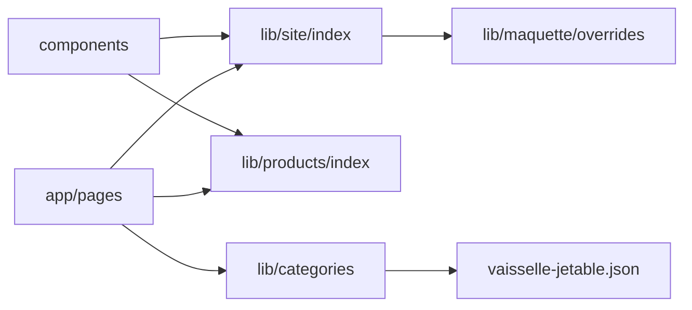

# Architecture — Maquette Ojetables

## Arborescence principale

```
app/                    Routes Next.js (App Router, RSC par défaut)
components/
  layout/               Header, footer, PageContainer, scroll reset
  sections/             Bandeaux homepage et catégorie
  product/              Fiche produit
  category/             Catalogue, filtres, pagination
  seo/                  JSON-LD (schemas/), meta OG
lib/
  site/                 Données marque (config, nav, destockage, secteurs…)
  products/             Types + fiche produit exemple
  maquette/             Overrides preview (à retirer en prod)
  types/                Types partagés (breadcrumb, review, teaser)
  routes.ts             Chemins canoniques maquette
  product-format.ts     Formatage prix / remises
  category-*.ts         Filtres, pagination, prix catalogue
```

## Flux de données



- **Server Components** : pages, bandeaux statiques, metadata, JSON-LD injecté côté serveur.
- **Client Components** : carrousels (`content-slider`), filtres catalogue, panier maquette, scroll reset.

## Imports publics stables

| Barrel | Usage |
|--------|--------|
| `@/lib/site` | Constantes marque, navigation, FAQ |
| `@/lib/products` | `getProduct()`, types produit |
| `@/lib/routes` | `productPath`, `featuredCategorySlug` |
| `@/components/seo/json-ld` | `JsonLd`, fonctions schema |

## SEO

4 pages indexables : `/`, `/vaisselle-jetable`, `/produit/gobelet-carton-24cl-kraft-individuel`, `/destockage`.

Sitemap et robots générés depuis `app/sitemap.ts` et `app/robots.ts`.
