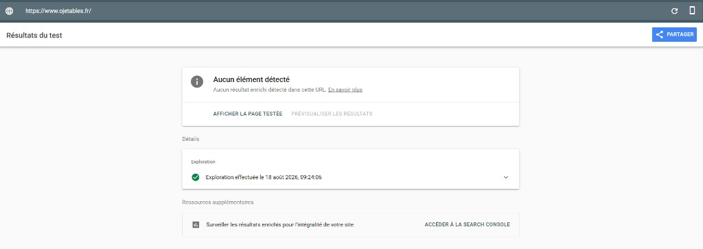
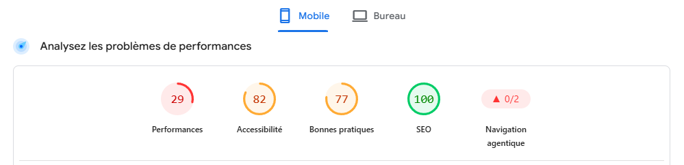
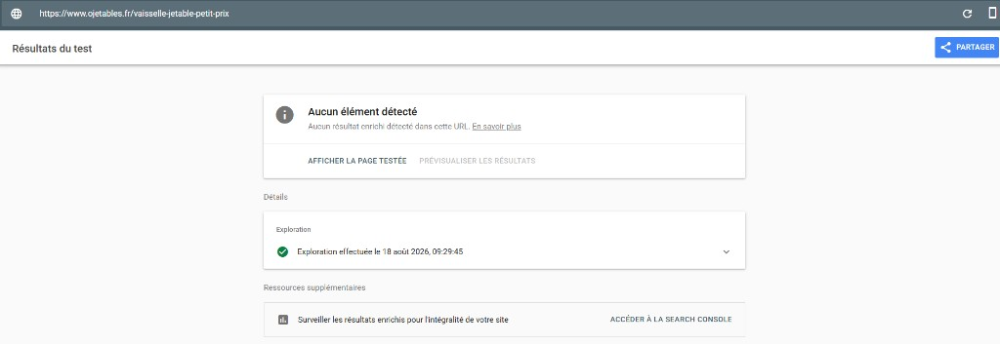
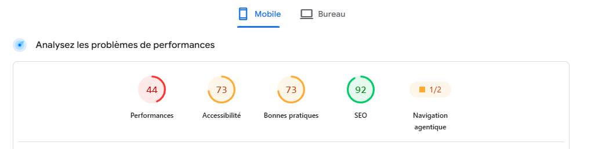
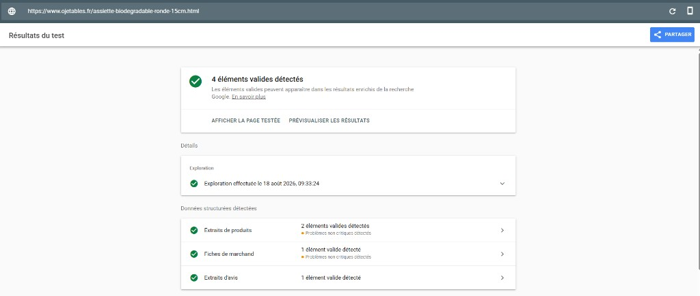

# Audit technique

> **Pages testées :**  
> - Homepage : [ojetables.fr](https://www.ojetables.fr/)  
> - Catalogue : [vaisselle-jetable-petit-prix](https://www.ojetables.fr/vaisselle-jetable-petit-prix)  
> - Fiche produit : [assiette-biodegradable-ronde-15cm](https://www.ojetables.fr/assiette-biodegradable-ronde-15cm.html)  
> **Date :** 18 août 2026  
> **Outils :** Google PageSpeed Insights · Rich Results Test

## Synthèse en une phrase

Votre site présente un **écart net entre templates** : les fiches produits ont du JSON-LD (4 éléments valides), mais homepage et catalogue n'en ont aucun. Partout, les **performances mobile restent faibles** (29 à 44/100) et la **navigation agentique est quasi absente** (0/2 ou 1/2). Sur +3 000 références, viser 90/100 est coûteux - la priorité est de **compléter les données structurées** (avis, disponibilité, livraison) et de **débloquer la lisibilité IA** sur tous les templates.

## Comparatif des 3 templates testés

| Métrique | Homepage | Catalogue | Fiche produit |
|----------|----------|-----------|---------------|
| **Performance** | 41/100 | **29/100** | 44/100 |
| **Accessibilité** | 81/100 | 82/100 | 73/100 |
| **Bonnes pratiques** | 77/100 | 77/100 | 73/100 |
| **SEO** | 100/100 | 100/100 | 92/100 |
| **Navigation agentique** | 0/2 | 0/2 | **1/2** |
| **Rich Results** | Aucun | Aucun | **4 éléments valides** |

**Lecture globale :**

- **Catalogue = le plus lent** (29) - 50 produits + filtres + mega-menu
- **Fiche produit = seul template avec JSON-LD** - mais incomplet (17 à 47 avertissements)
- **Navigation agentique 1/2 sur fiche produit** - seul signal positif, grâce au schema Product déjà présent
- **Homepage et catalogue = angle mort total** côté données structurées

**Constat clé :** Codebox a déjà branché du JSON-LD sur les fiches produits Magento - c'est une **base à compléter**, pas à recréer. En revanche, homepage et pages catalogue restent **invisibles pour les IA**.

## Homepage

| Métrique | Score | Lecture |
|----------|-------|---------|
| **Performance** | 41/100 | Temps de chargement et poids de page à traiter |
| **SEO** | 100/100 | Structure HTML et métadonnées OK |
| **Navigation agentique** | 0/2 | Site non lisible par les agents IA |
| **Rich Results** | Aucun | Pas de Organization, WebSite, AggregateRating |

**Manque prioritaire :** JSON-LD Organization + AggregateRating (vos 2 417 avis 9,5/10), FAQPage, WebSite.

## Page catalogue (exemple analysé)

**URL :** [https://www.ojetables.fr/vaisselle-jetable-petit-prix](https://www.ojetables.fr/vaisselle-jetable-petit-prix)  
**Title :** `Vaisselle Jetable | Assiettes, Couverts, Gobelets – Livraison 24h | Ojetables`  
**H1 :** Vaisselle jetable  
**Volume :** 630 produits listés, pagination sur 13 pages

| Métrique | Score | Lecture |
|----------|-------|---------|
| **Performance** | **29/100** | Très faible - pire que la homepage |
| **SEO** | 100/100 | Title et H1 présents, indexable |
| **Navigation agentique** | 0/2 | Catalogue illisible pour les IA |
| **Rich Results** | Aucun | Pas de ItemList, BreadcrumbList, Product |

### Pourquoi cette page est si lente (29/100)

| Facteur | Constat sur la page |
|---------|---------------------|
| **50 vignettes produits** chargées d'un coup | Chaque carte = image + titre + prix + CTA |
| **Sidebar filtres massive** | 30+ filtres (contenance, couleur, forme, conditionnement…) |
| **Mega-menu complet** dans le DOM | 11 rubriques × sous-menus profonds (Garcia de Pou inclus) |
| **Scripts tiers** | Avis Garantis, pop-ups, analytics |
| **Titres produits en MAJUSCULES** | Symptôme d'un template peu optimisé — voir [Fiches produits](strategie-seo-fiches-produits.md) |

Ce n'est **pas un bug isolé** : c'est le comportement standard de vos pages catégories Magento. Avec des centaines de pages catalogue similaires, chaque gain de performance se **multiplie**.

### Ce qui manque côté données structurées

Sur une page catalogue de 630 produits, Google et les IA s'attendent à trouver au minimum :

| Schema | Rôle | État actuel |
|--------|------|-------------|
| **BreadcrumbList** | Fil d'Ariane (`Accueil > Vaisselle jetable`) | Absent |
| **ItemList** | Liste des produits de la page (nom, URL, prix) | Absent |
| **Product** (par item) | Rich snippets prix / disponibilité | Absent |
| **FAQPage** | Questions fréquentes catégorie | Absent |

**Impact :** quand un utilisateur demande à ChatGPT « où acheter de la vaisselle jetable éco pas cher », l'IA ne peut pas extraire votre liste produits, vos prix ni votre positionnement - même si vous avez 630 références sur cette seule page.

### Contenu éditorial : présent mais sous-exploité

La page contient un bloc texte SEO en bas (« Organisez vos réceptions… », « Sélectionnez les produits biodégradables… ») - environ 300 mots. C'est un **bon début**, mais :

- Texte **replié** (« En savoir plus ») - moins visible pour les IA
- **Pas de H2 structurants** (tout en paragraphes)
- **Pas de FAQ** intégrée
- Vocabulaire **générique** (particuliers + pros mélangés) alors que la page pourrait cibler un angle clair

👉 Voir aussi : [Pages secteurs existantes](pages-secteurs-existantes.md) pour enrichir ce type de page

## Fiche produit (exemple analysé)

**URL :** [https://www.ojetables.fr/assiette-biodegradable-ronde-15cm.html](https://www.ojetables.fr/assiette-biodegradable-ronde-15cm.html)  
**Title :** `ASSIETTE BIODEGRADABLE NATUREL RONDE 15cm`  
**Prix affiché :** 4,90 € (pack de 100) · prix spécial 4,40 €

| Métrique | Score | Lecture |
|----------|-------|---------|
| **Performance** | 44/100 | Faible, mais meilleure que le catalogue (29) |
| **SEO** | 92/100 | Bon - légèrement en dessous homepage/catalogue |
| **Navigation agentique** | **1/2** | Seul template avec un signal IA (grâce au JSON-LD Product) |
| **Rich Results** | **4 éléments valides** | Product, Merchant listing, Review snippets |

### Ce qui fonctionne déjà (Rich Results)

Le Rich Results Test détecte **4 éléments valides** :

| Type | Éléments | Statut |
|------|----------|--------|
| **Extraits de produits** (Product) | 2 | Valide - avertissements non critiques |
| **Fiches de marchand** (Merchant listing) | 1 | Valide - avertissements non critiques |
| **Extraits d'avis** (Review) | 1 | Valide |

**Bonne nouvelle :** Magento génère déjà du JSON-LD Product + Offer + Review sur vos fiches. C'est la **seule base technique solide** du site pour Google Shopping et les IA.

### Ce qui manque (17 à 47 avertissements non critiques)

Google signale des champs **facultatifs mais stratégiques** absents :

| Champ manquant | Impact | Priorité |
|----------------|--------|----------|
| **`aggregateRating`** | Pas d'étoiles 9,5/10 dans les SERP produit | 🔴 P0 |
| **`review`** | Pas d'avis individuels enrichis | 🟡 P1 |
| **`availability`** | Stock / disponibilité absents (×15 offres) | 🔴 P0 |
| **`description`** | Pas de description produit dans le schema | 🟡 P1 |
| **`shippingDetails`** | Livraison 24/48h invisible pour Google Merchant | 🔴 P0 |
| **`hasMerchantReturnPolicy`** | Politique retour absente (Merchant Center) | 🟡 P1 |
| **GTIN / marque** | Identifiant produit absent | 🟢 P2 |

**Point d'attention :** le schema liste **15 offres avec des prix différents** (4,90 € · 7,50 € · 18,90 € · 1,70 €…) sur une seule fiche produit. Il s'agit probablement de **produits cross-sell ou variantes mal isolés** dans le JSON-LD - à corriger avec Codebox pour éviter de brouiller Google et les IA.

### Pourquoi c'est important pour les LLM

Avec `aggregateRating` + `availability` + `shippingDetails`, une IA qui reçoit la question *« assiette biodégradable 15 cm pas cher livraison rapide »* pourrait citer Ojetables avec **prix, note et délai** - exactement vos atouts. Aujourd'hui, elle ne voit qu'un nom en majuscules et une liste de prix incohérente.

👉 **Recommandations détaillées** : [Fiches produits](strategie-seo-fiches-produits.md)

## Rich Results : constat par template

| Template | Rich Results | Conséquence |
|----------|--------------|-------------|
| **Homepage** | Aucun élément | Pas de signal Organization / Rating global |
| **Page catalogue** | Aucun élément | 630 produits illisibles pour Google et les IA |
| **Fiche produit** | 4 éléments valides | Base OK, mais avis / stock / livraison absents |

| Lacune transversale | Conséquence |
|---------------------|-------------|
| Pas d'**aggregateRating** sur les fiches | Vous perdez 9,5/10 sur 2 417 avis dans les SERP |
| Pas d'**ItemList** sur les catalogues | Google Shopping / IA ne comprennent pas vos listings |
| Pas de signal **Organization** homepage | Les IA peinent à identifier « qui est Ojetables » |
| **15 offres** mélangées sur une fiche | Données produit brouillées pour les machines |

**Correctif prioritaire** : compléter le JSON-LD existant sur les fiches produits + déployer Organization (homepage) et ItemList (catalogue) via Codebox.

## Performance : être réaliste sur un gros catalogue

Avec **+3 000 références**, des centaines de pages catégories et un Magento 1.9 en fin de vie, viser 90/100 sur les pages catalogue est **théoriquement possible** mais **coûteux en temps et budget**. Ce n'est pas le premier levier à tirer.

### Pourquoi c'est compliqué chez vous

| Contrainte | Effet |
|------------|-------|
| **Magento 1 legacy** | Stack lourde, peu de lazy-loading natif |
| **Volume de pages** | Chaque optimisation doit tenir sur tout le catalogue |
| **Templates catalogue** | 50 produits + filtres = DOM très lourd |
| **Scripts tiers** | Avis Garantis, analytics, pop-ups |
| **Images produits** | Milliers de visuels, souvent non WebP |

### Objectifs réalistes par template

| Template | Score actuel | Objectif Quick Wins | Objectif 6 mois |
|----------|--------------|----------------------|-----------------|
| **Homepage** | 41 | 55-65 | 65-70 |
| **Page catalogue** | 29 | 40-50 | 50-60 |
| **Fiche produit** | 44 | 50-60 | 60-70 |

L'objectif n'est pas la perfection Lighthouse. C'est de **passer de « site lent et illisible par les machines » à « site acceptable pour humains et IA »**.

### Quick Wins performance (sans refonte)

1. **Lazy-loading images** catalogue (above-the-fold seulement en eager)
2. **WebP** sur vignettes produits
3. **Différer JS** non critique (filtres, pop-ups)
4. **Alléger sidebar** : filtres en AJAX / chargement différé
5. **Cache** : vérifier Varnish / Redis / CDN
6. **Réduire produits par page** : 50 → 24 ou 36 (test A/B)

## Navigation agentique : 0/2 ou 1/2 selon le template

| Template | Score | Lecture |
|----------|-------|---------|
| Homepage | 0/2 | Aucun signal IA |
| Catalogue | 0/2 | Listing illisible |
| **Fiche produit** | **1/2** | JSON-LD Product présent - signal partiel |

Les agents IA (ChatGPT, Perplexity, Google AI Overviews) ne peuvent pas **parcourir efficacement** homepage et catalogue. Sur les fiches produits, le schema Product existe mais reste **incomplet** (pas de rating global, pas de disponibilité, 15 offres mélangées).

### Ce qui manque encore

- **Homepage / catalogue** : pas de données structurées du tout
- **Fiches produits** : `aggregateRating` (9,5/10 · 2 417 avis), `availability`, `shippingDetails`
- **Global** : pas de **`llms.txt`**
- **Contenu** : titres MAJUSCULES, blocs repliés, peu extractible
- **FAQ** : absente sur la plupart des templates

👉 **Stratégie complète** : [GEO & AEO - Visibilité IA](geo-aeo-llm.md)

## Priorités techniques (90 jours)

| Priorité | Action | Template | Impact | Effort |
|----------|--------|----------|--------|--------|
| **P0** | JSON-LD **Organization + Rating** | Homepage | Étoiles Google + signal IA | 🟢 Faible |
| **P0** | JSON-LD **ItemList + BreadcrumbList** | Pages catalogue | Listing compréhensible par IA | 🟡 Moyen |
| **P0** | Compléter JSON-LD fiches : **aggregateRating + availability + shippingDetails** | Fiches produits | Étoiles + stock + livraison dans SERP | 🟡 Moyen |
| **P0** | Corriger **15 offres mélangées** dans le schema Product | Fiches produits | Données produit fiables pour IA | 🟡 Moyen |
| **P0** | Créer **`llms.txt`** | Global | Crawl IA facilité | 🟢 Faible |
| **P0** | Vérifier **robots.txt** (GPTBot, Google-Extended) | Global | 6 % des sites bloquent ChatGPT sans le savoir | 🟢 Faible |
| **P1** | **Lazy-load + WebP** vignettes | Catalogue | Performance +10-15 pts | 🟡 Moyen |
| **P1** | FAQ **schema FAQPage** | Catégories clés | Visibilité requêtes info | 🟢 Faible |
| **P1** | Alléger **scripts tiers** | Global | Performance + TBT | 🟢 Faible |
| **P2** | Audit **cache / CDN** complet | Global | Performance long terme | 🟡 Moyen |
| **P2** | Plan **migration Magento** | Global | Performance durable | 🔴 Élevé |

## Lien avec le reste du pré-audit

| Sujet | Page liée |
|-------|-----------|
| Données structurées fiches produits | [Fiches produits](strategie-seo-fiches-produits.md) |
| Homepage extractible pour les IA | [Page d'accueil SEO & CRO](strategie-seo-page-accueil.md) |
| Enrichir pages catégories existantes | [Pages secteurs (footer)](pages-secteurs-existantes.md) |
| Stratégie complète LLM / ChatGPT | [GEO & AEO](geo-aeo-llm.md) |
| Meta descriptions cassées | [Quick Wins](quick-wins.md) |

## Ce qu'un audit complet ajouterait

- Crawl complet des 3 000+ pages (Core Web Vitals **par template** : homepage, catégorie, fiche produit, page secteur)
- Analyse serveur (TTFB, cache, CDN, compression)
- Audit Magento 1.9 (modules, dette technique, plan migration)
- Benchmark performance vs concurrents directs
- Monitoring mensuel PageSpeed + Rich Results + présence IA

👉 **Suite possible** : [Périmètre audit complet](audit-complet-suite.md)

***

**Valentin Loriot**  
[contact@kaitos.agency](mailto:contact@kaitos.agency)  

