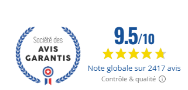
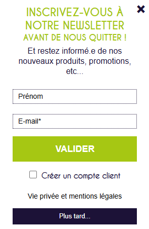
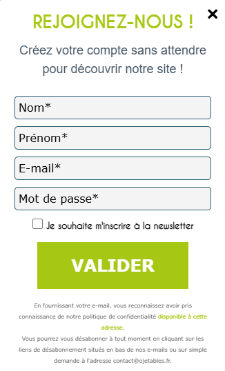

# Quick Wins

Voici **10 actions concrètes** que vous pouvez mettre en œuvre **rapidement**, en coordination avec votre prestataire technique actuel, pour améliorer la perception de votre site et vos résultats commerciaux.

## Les 10 leviers prioritaires

| # | Action | Effort | Impact | Pourquoi c'est important |
|---|--------|--------|--------|--------------------------|
| **1** | **Afficher vos logos clients dès la homepage** | 🟢 Faible | 🔴 Élevé | Air France, Sodexo, CNES, Louis Vuitton sont votre meilleur argument de vente - ils doivent être visibles en 3 secondes. Un simple bandeau « Ils nous font confiance » avec 5-6 logos + lien vers page Partenaire. |
| **2** | **Mettre en avant vos 2 417 avis 9,5/10** | 🟢 Faible | 🔴 Élevé | Vous avez une réputation exceptionnelle - utilisez-la ! Affichez le badge Avis Garantis de manière plus visible (header, homepage, fiches produits). |
| **3** | **Moderniser la typographie et l'espacement** | 🟡 Moyen | 🔴 Élevé | Votre contenu est excellent, mais la mise en page manque de respiration. Augmenter les tailles de police, espacer les blocs, créer une vraie hiérarchie visuelle. Impact immédiat sur la perception professionnelle. |
| **4** | **Corriger les meta descriptions cassées** | 🟢 Faible | 🔴 Élevé | Certaines de vos fiches produits affichent du code HTML dans Google - ça casse la confiance et réduit vos clics. Correctif technique simple côté Magento. |
| **5** | **Remplacer les pop-ups par un lead magnet** | 🟢 Faible | 🟡 Moyen | Vos 2 pop-ups actuelles sont intrusives. Proposez plutôt un **guide téléchargeable** (« Guide vaisselle éco CHR » pour les pros, « Check-list mariage éco » pour les particuliers) ou un code promo ciblé selon le profil. |
| **6** | **Auditer / mettre en place l'email marketing** | 🟡 Moyen | 🔴 Élevé | Analyse externe : aucune trace visible de Klaviyo, Mailchimp ou flows paniers abandonnés. **À vérifier** avec vous : une solution existe peut-être côté back-office. Si absente : 20-30 % du CA en e-commerce (paniers abandonnés, post-achat, saisonnier). Si présente : audit config + optimisation. |
| **7** | **Réécrire le H1 de la homepage** | 🟢 Faible | 🔴 Élevé | Votre H1 actuel (*« L'art de la table biodégradable et compostable avec une vaisselle jetable Ecologique, couverts Bois, Pla, Cpla… »*) est difficile à lire. Remplacez par une promesse claire : **« Vaisselle jetable éco pour professionnels »** + sous-titre. |
| **8** | **Lier vos pages secteur (footer) depuis la homepage** | 🟢 Faible | 🔴 Élevé | Vous avez déjà 10 pages métier (Traiteurs, CHR, Collectivités, Mariage…) cachées dans le footer. Créez 4 blocs homepage « Best-sellers par métier » qui pointent vers ces pages. Visibilité immédiate de votre offre segmentée. |
| **9** | **Enrichir vos pages B2C existantes (Mariage, Anniversaire)** | 🟡 Moyen | 🔴 Élevé | Vos pages [Mariage](https://www.ojetables.fr/vaisselle-jetable-mariage/) et [Anniversaire](https://www.ojetables.fr/vaisselle-jetable-anniversaire/) sont un bon début - ajoutez guides pratiques (quantités par invité), FAQ, photos inspiration, calculateur. Trafic organique +30-50 % sur ces thématiques. |
| **10** | **Clarifier le parcours personnalisation** | 🟡 Moyen | 🔴 Élevé | Messages contradictoires (« dès 1 pièce » vs MOQ 250/500), pas de page hub, express en SKU séparé, BAT invisible. Mettre en place un parcours 4 étapes + bouton menu dédié. Voir [Parcours personnalisation](parcours-personnalisation.md). |

## Illustrations (actions #2 et #5)

**Action #2 - Badge Avis Garantis à valoriser :**

**Action #5 - Pop-ups actuelles à remplacer :**

## Par où commencer ?

Si vous ne deviez en faire que **3 cette semaine** :

1. **Logos clients homepage** (action #1) - impact immédiat sur la confiance
2. **Lier pages secteur homepage** (action #8) - valoriser l'existant, améliorer navigation
3. **Corriger les meta descriptions** (action #4) - problème technique qui vous coûte des clics Google

Les 6 autres suivent naturellement une fois ces bases posées.

**Priorité court terme (30 jours)** : clarifier votre stratégie email marketing (action #6) - si absente, ROI immédiat ; si présente, optimisation possible.

👉 **Parcours personnalisation** : [Audit UX dédié](parcours-personnalisation.md) — parcours 4 étapes, MOQ, BAT, express  
👉 **Pages secteurs** : [Analyse pages existantes](pages-secteurs-existantes.md) - comment valoriser vos 10 pages footer  
👉 **Détail design & UX** : [Homepage & identité visuelle](ux-et-identite.md)  
👉 **Stratégie contenu B2C** : [Opportunité SEO](opportunite-b2c-seo.md)

***

**Valentin Loriot**  
[contact@kaitos.agency](mailto:contact@kaitos.agency)  

