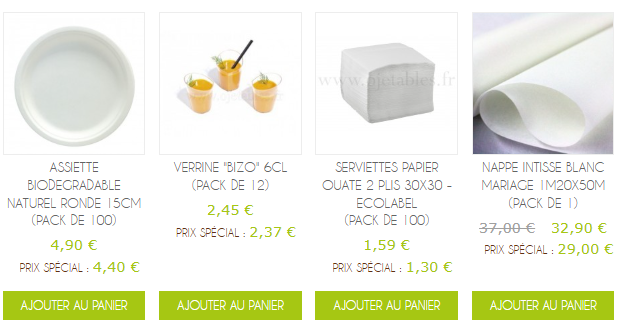

# Fiches produits

Vos fiches produits sont le **cœur de votre conversion**. Un visiteur peut adorer votre homepage, mais s'il arrive sur une fiche produit confuse ou peu rassurante, il part sans commander.

## Ce qui fonctionne déjà

- **Prix clairs** (HT + TTC affichés)
- **Visuels produits** (photos nettes)
- **Conditionnement** (quantités par carton, paliers)
- **Livraison direct chez Garcia de Pou** (pour certaines refs)

## Titres produits en MAJUSCULES : un problème catalogue entier

Sur le site actuel, **près de tous les noms produits** s'affichent en capitales dans les grilles catalogue — pas seulement sur les fiches produit. C'est un défaut de **données Magento** (noms importés en majuscules) souvent amplifié par le **template** (boutons et labels aussi en caps).



### Ce que voit l'acheteur (capture ci-dessus)

| Élément | Constat |
|---------|---------|
| **Nom produit** | `ASSIETTE BIODEGRADABLE NATUREL RONDE 15CM (PACK DE 100)` — 3–4 lignes, tout en majuscules |
| **Label promo** | `PRIX SPÉCIAL :` en caps |
| **CTA** | `AJOUTER AU PANIER` en caps |
| **Lisibilité** | Titres longs qui s'empilent ; aucune hiérarchie visuelle entre nom, conditionnement et specs |

### Pourquoi c'est un vrai problème (pas qu'esthétique)

| Impact | Explication |
|--------|-------------|
| **UX & conversion** | Les majuscules **ralentissent la lecture** et fatiguent sur mobile. Un acheteur pro qui compare 50 références sur une page catalogue **scanne** les titres — en caps, c'est plus lent et moins professionnel. |
| **Perception B2B** | Vos clients (Sodexo, traiteurs haut de gamme) sont habitués à des catalogues **soignés**. Une grille « catalogue discount 1998 » ne reflète pas votre positionnement premium éco. |
| **SEO & SERP** | Le **title** Magento reprend souvent le nom produit brut → Google affiche la même chose en majuscules dans les résultats. Moins engageant qu'un title lisible (*« Assiette biodégradable ronde 15 cm »*). |
| **Visibilité IA** | Les LLM et Google AI Overviews **reçoivent le texte brut** de la page. Des titres en caps partout dégradent l'extractibilité et la citation (*« ASSIETTE BIODEGRADABLE… »* vs un nom naturel). |

### Ce qu'il ne faut pas faire

- **Forcer en CSS** (`text-transform: lowercase`) sans traiter la source → casse les abréviations utiles (`XXL`, `CL`, `ML`, acronymes marque).
- **Réécrire 3 000 fiches** manuellement dans Magento → trop long pour un quick win.

### Ce que nous recommandons

| Niveau | Action | Effort |
|--------|--------|--------|
| **Quick Win template** | Fonction d'affichage : **casse lisible** sur le front (titres cartes + H1 fiche), en **conservant** tailles (`XXL`, `L`), unités (`15cm`, `750ml`) et acronymes courts (`SF`, etc.) | 🟢 Faible (Codebox ou refonte) |
| **Données** | Normaliser progressivement les **top 100–200 références** dans le back-office (titres SEO + lisibilité) | 🟡 Moyen |
| **Pattern title** | Adopter le format recommandé ci-dessous pour les titles / H1 (voir section SEO) | 🟢 Faible |
| **UI** | Boutons et labels (`Ajouter au panier`, `Prix spécial`) : **casse normale**, pas de `uppercase` CSS | 🟢 Faible |

### Ce que montre la maquette Kaitos

Sur la page catégorie `/vaisselle-jetable` de la **maquette interactive**, les titres sont **normalisés à l'affichage** :

- `ASSIETTE BIODEGRADABLE NATUREL RONDE 15CM` → **Assiette biodegradable naturel ronde 15cm**
- `GOBELET REUTILISABLE 25/33CL` → **Gobelet réutilisable 25/33cl**
- Les titres déjà mixtes (`Verrine "Bizo" 6cl`) restent inchangés

C'est le **même catalogue scrapé** — seul le **rendu** change. Aucune migration de données requise pour démontrer l'effet.


## Le problème : des meta descriptions cassées

### Exemple analysé

**URL** : `https://www.ojetables.fr/gobelet-reutilisable-personnalise-12440.html`

| Élément | Constat |
|---------|---------|
| **Title** | `GOBELET REUTILISABLE 25/33CL PERSONNALISE MULTICOULEURS` — tout en majuscules, difficile à lire, peu de contexte métier |
| **H1** | Identique au title (redondant) |
| **Meta description** | **Problème technique** : affiche du code HTML / attributs (`data-turn-id-container`, `data-is-intersecting`) dans les résultats Google |

### Impact sur votre business

- **Taux de clic en baisse** : quand Google affiche du code au lieu d'un texte, les gens ne cliquent pas
- **Perception de qualité** : un snippet Google cassé = site amateur (même si ce n'est pas le cas)
- **À généraliser** : probablement d'autres fiches ont le même souci (champ description mal nettoyé dans Magento)

**Correctif technique** : votre prestataire Codebox peut facilement nettoyer les balises meta avec un `strip_tags()` + limite 155–160 caractères.

## Recommandations UX & CRO pour les fiches produits

### 1. **Au-dessus du pli (ce que le visiteur voit en premier)**

- **Fil d'Ariane** clair : `Accueil > Gobelet / Verre > Gobelet réutilisable personnalisé`
- **Prix HT + TTC** + mention des paliers dégressifs (« -15 % dès 500 unités »)
- **Bandeau pro** (sticky ou juste sous le titre) : « ✓ Compte pro · ✓ Devis volume · ✓ Personnalisation logo · ✓ Livraison 24/48h »
- **Stock & délai** visible (ex. « En stock · Exp. sous 48h » ou « Délai 7–10 jours »)

### 2. **Réassurance B2B sous le bouton panier**

| Badge | Message |
|-------|---------|
| ✓ **Contact alimentaire** | Conforme usage alimentaire |
| ✓ **Tarifs pro** | Dégressifs dès X € HT |
| ✓ **Éco** | Compostable / Recyclable |
| ✓ **Avis** | 9,5/10 sur 2 417 avis |

### 3. **Description produit enrichie**

Actuellement, certaines descriptions sont très courtes. Ajoutez :

- **Usage** : traiteur, événement CHR, collectivité, mariage…
- **Matière** : carton kraft, PLA, bois, palmier, bagasse…
- **Contenance / dimensions** : ml, cm, nombre par colis
- **Conditionnement** : carton de 50, palette de 3 000, vrac possible

**Exemple** (150–200 mots) :

> Ce gobelet en carton kraft 120 ml est idéal pour les **traiteurs**, **food trucks** et **événements** recherchant une alternative éco-responsable aux gobelets plastiques. Fabriqué en carton certifié FSC avec un intérieur **Plastic Free**, il est **100 % compostable** après usage.
>
> **Conditionnement** : carton de 1 000 unités (20 sleeves de 50). Livraison **24/48h** partout en France. Tarifs dégressifs sur volumes.
>
> **Personnalisation possible** : impression logo 1–4 couleurs (devis sur demande, minimum 1 000 pièces).

### 4. **Cross-sell « Souvent achetés avec »**

Proposez des produits complémentaires logiques :

- Gobelet → couvercles, pailles carton, sacs kraft
- Assiette → couverts bois, serviettes kraft
- Plateau repas → sacs isothermes, étiquettes

### 5. **FAQ produit** (bloc accordéon)

3–5 questions fréquentes :

- Ce produit est-il compostable en compostage domestique ou industriel ?
- Quel est le délai pour la personnalisation avec logo ?
- Y a-t-il un minimum de commande ?
- Livraison possible en urgence (J+1) ?
- Compatible micro-ondes / four ?

### 5 bis. **Onglet Personnalisation** (fiches concernées)

Pour les produits personnalisables, ajouter un onglet ou encart dédié avec :

- Parcours en **4 étapes** (produit → quantité → visuel → BAT)
- **MOQ et délai** selon la technique (carton 250 pcs, digital dès 1 pcs, sérigraphie 500 pcs)
- Zone **upload logo** (post-commande ou pré-devis)
- Option **express** en toggle, pas en SKU séparé

👉 Voir [Parcours personnalisation](parcours-personnalisation.md)

## SEO fiche produit : pattern de title recommandé

**Format** :

```
{Produit} {contenance/taille} — {usage pro} | Ojetables
```

**Exemples** :

- `Gobelet carton kraft 120 ml — Traiteur & CHR | Ojetables`
- `Assiette palmier 26 cm — Restauration éco | Ojetables`
- `Plateau repas 5 compartiments — Collectivités | Ojetables`

**Meta description** : toujours une phrase complète avec CTA, jamais de HTML.

## Données structurées (JSON-LD) : déjà présentes, à compléter

### Test Rich Results - exemple analysé

**URL :** [assiette-biodegradable-ronde-15cm.html](https://www.ojetables.fr/assiette-biodegradable-ronde-15cm.html)


| Type détecté | Éléments | Statut |
|--------------|----------|--------|
| Extraits de produits (Product) | 2 | Valide |
| Fiches de marchand (Merchant listing) | 1 | Valide |
| Extraits d'avis (Review) | 1 | Valide |

**Bonne nouvelle :** Magento génère déjà du JSON-LD sur vos fiches produits. C'est une **base solide** - contrairement à la homepage et aux pages catalogue, qui n'ont **aucune** donnée structurée.

### Ce qui manque (priorités)

| Champ absent | Impact business | Action |
|--------------|-----------------|--------|
| **`aggregateRating`** | Vos 9,5/10 sur 2 417 avis n'apparaissent pas en étoiles sur les fiches | Brancher Avis Garantis dans le schema Product |
| **`availability`** | Stock / « En stock » invisible dans Google | Ajouter `InStock` / `OutOfStock` par variante |
| **`shippingDetails`** | Livraison 24/48h absente du Merchant Center | Structurer délais + zones de livraison |
| **`description`** | Description produit absente du schema | Reprendre les 150 premiers mots de la fiche |
| **`review`** | Avis individuels non enrichis | Optionnel - si Avis Garantis l'autorise |

### Anomalie à corriger : 15 offres sur une fiche

Le schema Product de cette assiette liste **15 offres avec des prix différents** (4,90 € · 7,50 € · 18,90 € · 1,70 €…) alors que le produit affiché coûte 4,90 € le pack de 100.

**Hypothèse :** cross-sell, produits associés ou variantes **mal isolés** dans le template Magento JSON-LD.

**Risque :** Google et les IA reçoivent des données produit **incohérentes** - prix erronés, rich snippets dégradés, confiance en baisse.

**Correctif Codebox :** limiter le schema à **l'offre principale** (+ variantes réelles si configurables), exclure les blocs cross-sell.

### Objectif cible par fiche produit

```json
{
  "@type": "Product",
  "name": "Assiette biodégradable ronde 15 cm",
  "description": "Assiette en pulpe de canne, 100 % compostable…",
  "brand": { "@type": "Brand", "name": "Ojetables" },
  "aggregateRating": {
    "@type": "AggregateRating",
    "ratingValue": "9.5",
    "reviewCount": "2417"
  },
  "offers": {
    "@type": "Offer",
    "price": "4.90",
    "priceCurrency": "EUR",
    "availability": "https://schema.org/InStock",
    "shippingDetails": { … }
  }
}
```

👉 **Audit technique complet** : [Audit technique](audit-technique.md) - comparatif 3 templates

## Maquette PDP (livrable pour votre Meet)

Nous vous proposerons une maquette web interactive avec :

- **Colonne gauche** : galerie photo + zoom
- **Colonne droite** : titre, prix HT/TTC, variantes (taille, couleur), badges réassurance, CTA « Ajouter au panier » + **CTA « Demander un devis »** (pour volumes)
- **Tabs en dessous** : Description · Spécifications · Livraison · Personnalisation · Avis clients
- **Footer fiche** : bandeau logos clients (allégé) — rappel confiance

👉 **Quick fix meta** : [Quick Wins](quick-wins.md) — action #4

***

**Valentin Loriot**  
[contact@kaitos.agency](mailto:contact@kaitos.agency)  

