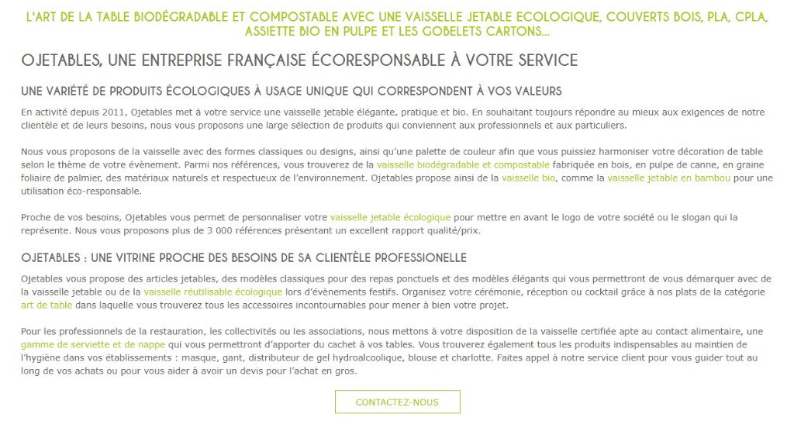

---
title: Page d'accueil (SEO & CRO)
description: Optimiser la visibilité Google et le message pro
---

# Page d'accueil (SEO & CRO)

## Métadonnées actuelles

| Élément | État actuel | Observation |
|---------|-------------|-------------|
| **Title** | `Vaisselle Jetable Biodégradable & Éco-responsable \| Livraison 24h - Ojetables` | Orienté B2C générique — sous-exploite votre positionnement pro |
| **Meta description** | `Spécialiste depuis 2011 en vaisselle jetable biodégradable… Livraison 24/48h partout en France.` | Manque d'appel à l'action pro (devis, compte, tarifs) |
| **H1** | *« L'art de la table biodégradable et compostable avec une vaisselle jetable Ecologique, couverts Bois, Pla, Cpla… »* | Trop long, difficile à lire, liste de mots-clés plutôt qu'une vraie promesse |



### Pourquoi c'est important

Vos métadonnées sont la **première impression** que Google et les visiteurs ont de vous. Un title ou une meta description flous = moins de clics, même si vous êtes bien positionné.

## Propositions optimisées

### Title (exemple)

```html
<title>Ojetables | Vaisselle jetable professionnelle & éco — Livraison 24/48h</title>
```

**Ou, si vous voulez insister sur le devis volume** :

```html
<title>Ojetables | Fournisseur vaisselle jetable pro & éco — Devis volume · Livraison 24/48h</title>
```

### Meta description (exemple)

```html
<meta name="description" content="Fournisseur vaisselle jetable et emballages éco pour traiteurs, CHR et collectivités. +3 000 références, tarifs pro, livraison 24/48h. Compte pro et devis en ligne.">
```

**Bénéfices** : vocabulaire pro (traiteurs, CHR, collectivités), chiffres concrets (+3 000 refs), CTA clair (compte pro, devis).

### H1 + sous-titre

| Élément | Texte proposé |
|---------|---------------|
| **H1** | **Vaisselle jetable éco-responsable pour professionnels** |
| **Sous-titre** | Traiteurs, restaurateurs, collectivités : +3 000 références en stock, livraison 24/48h, tarifs dégressifs. Particuliers & événements : [lien secondaire] |

Simple, clair, hiérarchisé.

## Structure de page (hiérarchie H2)

Votre homepage doit raconter une **histoire** en 5–6 blocs. Voici la structure recommandée :

| H2 | Rôle | Contenu |
|----|------|---------|
| **Ils nous font confiance** | Preuve sociale B2B | Logos clients (Air France, Sodexo, CNES, Louis Vuitton, Newrest) |
| **Best-sellers par métier** | Conversion pro | 4 blocs produits : Traiteurs · CHR · Collectivités · Personnalisation |
| **Pourquoi Ojetables ?** | Réassurance | 9,5/10 sur 2 417 avis · Livraison 24/48h · Paiement 30j · Vu à la télé |
| **Personnalisation & volumes** | CTA devis | Gobelets, sacs, couverts avec logo — devis sous 24h |
| **Nos engagements éco** | Story RSE | AGEC, compostable, biodégradable, fournisseurs responsables |
| **Événements privés** | Entrée B2C | Mariage, anniversaire, réception — petites quantités |

Chaque H2 = un objectif clair. Pas de blocs « fourre-tout ».

## Copy & maillage interne

Sous votre H1, ajoutez **2–3 phrases** (100–150 mots) avec du vocabulaire métier :

> Depuis 2011, Ojetables accompagne les **professionnels de la restauration, de l'hôtellerie et de l'événementiel** avec une gamme complète de vaisselle jetable et d'emballages **biodégradables, compostables et recyclables**. Traiteurs, cantines, collectivités : bénéficiez de **tarifs dégressifs**, d'un **stock permanent** sur +3 000 références, et d'une **livraison 24/48h** partout en France. Conformité **loi AGEC**, produits certifiés **contact alimentaire**. 
>
> **Créez votre compte pro** ou **demandez un devis volume** en 2 minutes.

Puis **maillage interne visible** vers :

- [Vaisselle jetable professionnelle](https://www.ojetables.fr/vaisselle-jetable-professionnel/)
- [Partenaires & références clients](https://www.ojetables.fr/partenaire-vaisselle-jetable/)
- 2–3 catégories cœur (assiettes compostables, gobelets carton, plateaux repas)

## Hero & visuels

Inspiré de notre travail pour Orod (catalogue B2B similaire) : planifiez un **calendrier de visuels hero** selon les saisons commerciales :

- **Rentrée scolaire** (août–sept) : cantines, collectivités
- **Saison traiteur** (avril–juin, sept–oct) : événements, mariages pro
- **Fêtes de fin d'année** (nov–déc) : CHR, plateaux repas, personnalisation

Visuels créés une fois, rotation automatisée si possible.

## Email marketing : le levier oublié (à vérifier)

### Constat (analyse externe)

Lors de notre analyse du site, nous n'avons détecté **aucune trace visible** d'une stratégie d'email marketing automation :

- Pas de mention de Klaviyo, Mailchimp ou autre plateforme emailing dans les scripts front-end
- Pas de séquence de bienvenue post-inscription évidente
- Test panier abandonné (externe) : panier créé, abandon, **aucun email reçu sous 48h**

**⚠️ Important** : cette analyse est **externe uniquement**. Il est tout à fait possible qu'une solution soit en place côté back-office Magento (emails envoyés via serveur sans scripts front-end détectables). **À clarifier avec vous ou Codebox lors du Meet.**

### Deux scénarios possibles

#### Scénario 1 : Aucune stratégie email marketing active

Si aucune solution n'est en place, vous laissez passer un levier majeur :

| Scénario | Taux moyen secteur | Potentiel Ojetables |
|----------|-------------------|---------------------|
| **Panier abandonné** (B2B) | 10-15 % de récupération | Sur 100 paniers/mois × panier moyen 300 € HT = **3 000-4 500 € HT/mois** |
| **Panier abandonné** (B2C) | 5-10 % de récupération | Volumes plus faibles mais taux de transformation + élevé |
| **Post-achat** (cross-sell) | +15-20 % revenue/client | Relance produits complémentaires (couvercles, serviettes, sacs) |
| **Campagnes saisonnières** | 5-10 % CA | Rentrée scolaire (cantines), fêtes de fin d'année (traiteurs, CHR) |
| **Réactivation clients inactifs** | 3-5 % CA | Base clients existante (2-3 ans d'historique) |

**ROI estimé** : entre 25× et 40× l'investissement plateforme (source : benchmarks Klaviyo e-commerce 2025-2026).

#### Scénario 2 : Une solution existe déjà

Si vous avez déjà Klaviyo, Brevo ou un autre outil en place, nous pouvons **auditer votre configuration** :

- Flows actifs : paniers abandonnés (B2B et B2C), post-achat, bienvenue
- Segmentation : pros vs particuliers, actifs vs inactifs, RFM
- Performances : taux d'ouverture, taux de clic, revenus générés par canal
- Opportunités manquées : campagnes saisonnières, réactivation, cross-sell

**Livrable** : rapport d'audit email marketing (10-15 pages) avec recommandations priorisées.

### Ce que vous pourriez gagner (si absent)

#### B2B (traiteurs, CHR, collectivités)

| Flux | Déclencheur | Contenu |
|------|-------------|---------|
| **Panier abandonné** | Panier > 150 € HT non validé sous 2h | Email #1 (J+0, 2h) : rappel + lien panier · Email #2 (J+1) : « Besoin d'un devis ? » + contact direct · Email #3 (J+3) : code promo 5 % si commande > 500 € HT |
| **Post-achat pro** | Commande confirmée | J+3 : demande avis (Avis Garantis) · J+15 : « Vous pourriez avoir besoin de… » (cross-sell) · J+30 : rappel tarifs dégressifs, compte pro |
| **Calendrier marketing** | Date clé métier | **Rentrée scolaire** (15 août) : cantines, collectivités · **Saison traiteur** (1er mars) : mariages, événements · **Fêtes** (1er novembre) : CHR, plateaux repas, personnalisation |
| **Réactivation** | Aucun achat depuis 6 mois | « Vos produits habituels sont de retour » + nouveautés catalogue + code 10 % |

#### B2C (mariages, anniversaires, événements privés)

| Flux | Déclencheur | Contenu |
|------|-------------|---------|
| **Panier abandonné** | Panier > 50 € TTC non validé sous 1h | Email #1 (J+0, 1h) : rappel + visuel produits · Email #2 (J+1) : « Livraison 24/48h garantie » · Email #3 (J+2) : code promo 10 % (usage unique) |
| **Guides événements** | Inscription newsletter | Séquence bienvenue : Guide PDF « Quantités vaisselle par invité » · Idées déco mariage éco · Calculateur en ligne |
| **Saisonnalité B2C** | Calendrier | **Mariages** (janvier-février) : saison booking mariages · **Anniversaires** (toute l'année) : rappel 1 mois avant date événement (si collectée) |

### Stack technique recommandée (si mise en place)

Pour un catalogue comme le vôtre (+3 000 refs, B2B + B2C, Magento 1.9), nous recommandons :

| Plateforme | Avantages Ojetables | Prix indicatif |
|-----------|---------------------|----------------|
| **Klaviyo** | Intégration native Magento · Segmentation avancée B2B/B2C · Flows paniers abandonnés · Calendrier marketing · Analytics revenus | ~150-300 €/mois (selon volume emails) |
| **Brevo (ex-Sendinblue)** | Moins cher · Interface FR · Marketing automation basique OK | ~50-150 €/mois |
| **ActiveCampaign** | CRM + emailing · Si vous voulez tracker comptes pros en profondeur | ~100-200 €/mois |

**Notre préférence pour vous** : Klaviyo - ROI prouvé en e-commerce, segmentation fine (B2B vs B2C), excellent sur paniers abandonnés.

### Mise en place (feuille de route 30 jours - si inexistant)

| Semaine | Action | Livrable |
|---------|--------|----------|
| **S1** | Choix plateforme + installation connector Magento | Klaviyo branché, emails synchronisés |
| **S2** | Créer 3 flows prioritaires : panier abandonné B2B · panier abandonné B2C · post-achat | Flows actifs, tests envoyés |
| **S3** | Segmenter base existante (pros vs particuliers, actifs vs inactifs) | Segments créés dans Klaviyo |
| **S4** | Première campagne réactivation sur clients inactifs 6-12 mois | Email envoyé, premiers résultats mesurés |

**Suivi mensuel** : taux d'ouverture, taux de clic, revenus générés par canal (panier abandonné, post-achat, campagnes).

### Impact business estimé (6 mois - si mise en place)

Sur une base hypothétique de **1 500 paniers créés/mois** (tous segments) avec un **taux d'abandon de 60 %** (moyenne e-commerce) :

- **900 paniers abandonnés/mois**
- Taux de récupération email : **12 % moyen** (B2B + B2C)
- **108 commandes récupérées/mois**
- Panier moyen Ojetables (estimé) : **200 € HT**
- **Gain mensuel paniers abandonnés seuls** : **21 600 € HT/mois** soit **259 200 € HT/an**

Ce chiffre ne compte **pas** les campagnes saisonnières, le post-achat, ni la réactivation - uniquement les paniers abandonnés.

**ROI conservateur à 6 mois** : +15-20 % CA global, avec un coût plateforme de ~150-200 €/mois + 2-3 jours de setup initial.

### Prochaine étape

**Lors de notre Meet de 30 min** : clarifier si une solution email marketing est déjà en place. Si oui : audit de l'existant. Si non : roadmap de mise en place.

## Mesure & suivi

Avant toute refonte, nous établissons une **baseline** :

- **Search Console** : requêtes actuelles (« vaisselle jetable pro », « grossiste emballage traiteur », « gobelet carton personnalisé »), clics, impressions, position moyenne
- **Analytics** : taux de rebond homepage, temps sur page, parcours vers catégories/fiches produits
- **Conversion** : taux création compte pro, demandes de devis
- **Email marketing** : revenus par canal (abandonné, post-achat, campagnes), taux engagement

6 mois après refonte → comparaison avant/après.

## Données structurées et visibilité IA

Le Rich Results Test sur votre homepage retourne **« Aucun élément détecté »** - aucun JSON-LD Organization, AggregateRating ou FAQPage. Résultat : vos 2 417 avis 9,5/10 n'apparaissent pas en étoiles dans Google, et les IA (ChatGPT, Perplexity) peinent à vous citer.

**Priorité P0 :** déployer du JSON-LD sur la homepage (Organization + Rating) et les fiches produits (Product + Offer). C'est le levier le plus accessible pour débloquer la visibilité IA, sans attendre une refonte performance.

👉 **Audit technique** : [PageSpeed & Rich Results](audit-technique.md)  
👉 **Stratégie LLM** : [GEO & AEO](geo-aeo-llm.md)

👉 **Détail design** : [Homepage & identité visuelle](ux-et-identite.md)

***

**Valentin Loriot**  
[contact@kaitos.agency](mailto:contact@kaitos.agency)  

