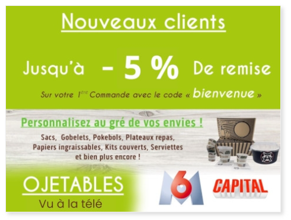

# Homepage & identité visuelle

## Votre homepage en 5 secondes

Quand un acheteur professionnel (traiteur, responsable achats collectivité, gérant CHR) arrive sur votre site, il doit **comprendre immédiatement** :

1. **Qui vous êtes** : fournisseur pro vaisselle éco, pas un site grand public
2. **Qui vous fait confiance** : Air France, Sodexo, CNES, Louis Vuitton…
3. **Comment commander** : compte pro, devis volume, tel direct

Actuellement, ces 3 informations sont dispersées ou absentes du premier écran.

## Ce qui fonctionne déjà (à garder)

- **Téléphone visible** (0974060074) — excellent signal pro
- **Identité éco forte** — verts, kraft, visuels produits naturels
- **Structure marchande** — promotions, produits mis en avant



## Ce qui mérite d'être retravaillé

### 1. **Design et hiérarchie visuelle**

Votre contenu est riche, mais la mise en page manque de **respiration** et de **contraste**. Tout se vaut visuellement — les titres, les textes, les prix, les CTA. Sur mobile, c'est encore plus dense.


**Titres produits en MAJUSCULES** : sur la grille catalogue, les noms s'affichent presque tous en capitales (données Magento + template). Ça nuit à la lisibilité, à la perception pro et aux snippets Google. Voir l'analyse détaillée avec capture dans [Fiches produits](strategie-seo-fiches-produits.md).

**Recommandations design** :

- Augmenter les **tailles de typo** (titres H2, H3, prix)
- Renforcer le **contraste** (textes sur fonds clairs, boutons plus marqués)
- **Espacer les blocs** (plus d'air blanc entre sections)
- Moderniser les **icônes et badges** (livraison, éco, paiement 30j)

Votre palette éco (vert, kraft, beige) est parfaite — on la garde, on la structure mieux.

### 2. **Hero & message d'entrée**

Votre H1 actuel (*« L'art de la table biodégradable et compostable avec une vaisselle jetable Ecologique, couverts Bois, Pla, Cpla, assiette bio en pulpe… »*) essaie de tout dire à la fois. C'est trop long, difficile à lire, et ça ne parle ni au pro ni au particulier clairement.


**Proposition** :

```
H1 : Vaisselle jetable éco-responsable pour professionnels
Sous-titre : Traiteurs, CHR, collectivités : +3 000 références, stock permanent, livraison 24/48h
```

Puis un **double CTA** :

- **Compte pro & devis volume** (principal)
- **Particuliers / événements** (secondaire)

### 3. **Le trésor caché : vos clients prestigieux**

Vous avez des références **exceptionnelles** — Air France, Sodexo, CNES, Louis Vuitton, Newrest — mais elles n'apparaissent que sur la page [Partenaire](https://www.ojetables.fr/partenaire-vaisselle-jetable/).

Pour un acheteur pro, ces noms sont **le signal de confiance n°1**. Ils doivent être sur la homepage, au-dessus du pli.

**Structure proposée** :

```
[ Bandeau fond gris clair, juste sous le hero ]

          ILS NOUS FONT CONFIANCE
[Logo Air France] [Logo Sodexo] [Logo CNES] [Logo Louis Vuitton] [Logo Newrest] [+]

       → En savoir plus sur nos partenariats professionnels
```

Même si vous n'avez pas l'autorisation d'utiliser les logos officiels en couleur, vous pouvez afficher les **noms en texte** ou en **logos monochrome** — c'est toujours plus fort que de les cacher.

### 4. **Vos best-sellers : valoriser vos pages secteur existantes**

La section « Nos produits mis en avant » affiche des produits variés sans logique claire. Un traiteur ne cherche pas la même chose qu'une cantine ou qu'un organisateur de mariage.

**Bonne nouvelle** : vous avez **déjà créé 10 pages secteur** (Traiteurs, CHR, Collectivités, Hôtels, Mairies, Associations, Mariage, Anniversaire…) - elles sont juste cachées dans le footer !

**Proposition** : 4 blocs produits sur la homepage qui **pointent vers vos pages secteur existantes**

| Bloc | Cible | Exemples produits | CTA |
|------|-------|-------------------|-----|
| **Traiteurs & événementiel** | Pros événements | Kits couverts, verrines, plateaux repas | « Voir la gamme traiteur » → [/vaisselle-jetable-traiteur/](https://www.ojetables.fr/vaisselle-jetable-traiteur/) |
| **CHR & restauration** | Restos, cafés, food trucks | Gobelets carton, barquettes, sacs kraft | « Voir la gamme resto » → [/vaisselle-jetable-restaurant/](https://www.ojetables.fr/vaisselle-jetable-restaurant/) |
| **Collectivités & cantines** | Mairies, écoles, hôpitaux | Plateaux compartiments, volumes | « Demander un devis » → [/vaisselle-jetable-collectivite/](https://www.ojetables.fr/vaisselle-jetable-collectivite/) |
| **Personnalisation** | Tous pros + événements privés | Gobelets, sacs, couverts avec logo | « Devis personnalisation » |

Chaque carte produit affiche : **prix HT**, **badge « Pro »**, **livraison 24/48h**.

👉 **Analyse complète** : [Pages secteurs existantes](pages-secteurs-existantes.md) - comment optimiser vos 10 pages footer

### 5. **Réassurance visible : vos atouts cachés**

Vous avez **2 417 avis certifiés avec 9,5/10** — c'est énorme ! Et vous êtes passés à la **télé sur M6 et Capital**. Ces preuves sont actuellement sous-exploitées.


**Bloc réassurance homepage** (sous les best-sellers) :

```
[ 4 colonnes, icônes + texte ]

✓  9,5/10 sur 2 417 avis certifiés
✓  Livraison 24/48h partout en France
✓  Paiement sous 30 jours (comptes pro)
✓  Vu à la télé (M6, Capital)
```

### 6. **B2C : visible mais secondaire**

Vous ne devez **pas supprimer** l'offre particuliers (mariages, anniversaires, petits événements). Mais elle ne doit **pas rivaliser** avec le message pro en entrée.

**Solution** : un encart dédié, en bas de homepage ou en sidebar :

```
🎉  Organisez un mariage, une réception, un anniversaire ?

Vaisselle éco dès petites quantités  →  Voir nos solutions événements
```

Cela respecte votre réalité business (80 % pro / 20 % particuliers) sans frustrer l'audience B2C.

### 7. **Navigation : simplifier le mega-menu**

Votre menu principal a **11 rubriques de niveau 0** + sous-menus très profonds (ex. marque Garcia de Pou au même niveau que les catégories produits). Sur mobile, c'est difficile à parcourir.

**Recommandation** (phase maquette) :

- Menu principal : **Produits** (megamenu) · **Personnalisation** · **Destockage** · **Pro / Devis** · **Éco / Engagements** · **Contact**
- **Personnalisation** et **Destockage** en boutons dédiés niveau 1 — accès direct (aujourd'hui noyés dans le catalogue)
- Garcia de Pou → sous-section « Marques » ou filtre catalogue, pas entrée menu principale

👉 **Parcours personnalisation détaillé** : [Parcours personnalisation](parcours-personnalisation.md) — audit UX du parcours actuel + proposition 4 étapes

## Direction créative (pour les maquettes)

1. **Hero en deux colonnes** :
   - Gauche : H1 + sous-titre + double CTA (pro / particulier)
   - Droite : visuel produit phare (plateau repas bio, kit traiteur éco)

2. **Palette modernisée** :
   - Conserver vos verts, kraft, beige (identité forte)
   - Ajouter un contraste typographique (titres noirs francs, corps gris foncé)
   - Buttons CTA : vert vif pour principal, contour pour secondaire

3. **Fiche produit** (voir page dédiée) :
   - Bandeau pro en haut : « Compte pro · Tarifs dégressifs · Devis sous 24h »
   - Galerie photo + zoom
   - Prix HT/TTC + paliers volume
   - Avis clients intégrés

## Coordination avec votre prestataire

Toute modification design doit passer par **Codebox** (votre prestataire technique Magento). Nous livrerons des **maquettes web interactives** + spécifications (grilles, composants, responsive) pour cadrer l'intégration.

👉 **SEO homepage** : [Page d'accueil SEO & CRO](strategie-seo-page-accueil.md)

***

**Valentin Loriot**  
[contact@kaitos.agency](mailto:contact@kaitos.agency)  

